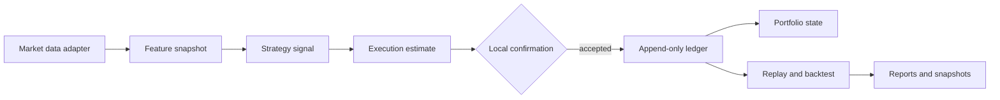

# Reference Architecture

## Design Goal

The terminal is a compact reference for one engineering principle: every stage
of a research workflow should exchange explicit data rather than hidden UI
state. Strategy math is deterministic, execution constraints are calculated
before confirmation, and portfolio state can be rebuilt from the ledger.

## Contracts

### Strategy Signal

`StrategySignal` carries a strategy name, action, requested amount, and note.
Signal calculation does not mutate portfolio state.

### Execution Estimate

`ExecutionEstimate` carries executable amount, estimated quantity, fee,
slippage, and an explicit status such as `FILLED`, `PARTIAL_CASH_LIMIT`, or
`REJECTED_NO_POSITION`.

This is the boundary where a real system could replace the local estimator with
a broker preview adapter. The reference application deliberately stops before
that integration.

### Ledger

The ledger is append-only from the application's perspective. Its stable fields
cover identity, requested action, fill estimate, costs, resulting cash and
position, model context, and a note. Import mapping normalizes external columns
into this schema.

### Portfolio State

Portfolio state is a projection of ledger events. `rebuild_portfolio_state_from_ledger`
replays entries in timestamp order, making state recovery testable instead of
depending on a mutable UI session.

## Reusable Modules

The following pieces are suitable for reuse in other educational or research
projects:

1. Pure VA, DCA, and rebalance signal functions.
2. Cash, position, fee, and slippage constraint calculations.
3. Append-only ledger normalization and column mapping.
4. Ledger-to-state replay.
5. Backtest metrics and report packaging.
6. Streamlit confirmation and export patterns.

## Extension Points

| Reference component | Production replacement |
| --- | --- |
| `yfinance` adapter | Licensed market-data provider with quality metadata |
| Local execution estimate | Broker/exchange preview with idempotency key |
| CSV ledger | Transactional append-only store |
| JSON portfolio state | Derived read model rebuilt from ledger events |
| Local confirmation | Authenticated approval workflow with audit identity |
| Single Streamlit process | API, worker, and frontend deployment boundaries |

## Production Hardening Checklist

- Add authentication, authorization, and immutable audit identity.
- Define idempotency and retry contracts before connecting a broker.
- Separate command handling from read models.
- Validate market-data timestamps, source, and freshness.
- Use decimal or integer minor units where accounting precision is required.
- Add migrations for every ledger schema change.
- Add integration tests against sandbox provider APIs.
- Add health and heartbeat contracts instead of inferring process liveness.

These are intentionally not simulated as complete in this public reference.
